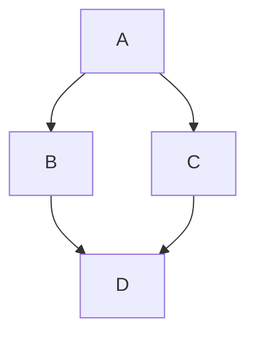

# Markdown Syntax Guide

A comprehensive reference for Markdown formatting.

## Headings

# H1 Heading

## H2 Heading

### H3 Heading

#### H4 Heading

##### H5 Heading

###### H6 Heading

Alternative syntax for H1 and H2:

# Heading 1

## Heading 2

## Emphasis

_italic_ or _italic_ **bold** or **bold** **_bold italic_** or **_bold italic_**
~~strikethrough~~

## Line Breaks & Paragraphs

- Leave a blank line between paragraphs.
- End a line with two or more spaces to force a line break within a paragraph.
- Use `<br>` for an explicit HTML line break.

## Lists

**Unordered:**

- Item one
- Item two
    - Nested item
    - Nested item

* Item using asterisk

- Item using plus

**Ordered:**

1. First item
2. Second item
    1. Nested item
    2. Nested item
3. Third item

**Task lists (GitHub Flavored Markdown):**

- [x] Completed task
- [ ] Incomplete task
- [ ] Another task

## Links

[Link text](https://example.com)
[Link with title](https://example.com 'Title text') <https://example.com>
(automatic link) [Reference link][ref-id]

[ref-id]: https://example.com 'Optional title'

## Images


[](https://example.com)

## Blockquotes

> This is a blockquote. It can span multiple lines.
>
> > Nested blockquote.

## Code

**Inline code:** Use `code` inline like this.

**Fenced code block:**

```
plain code block
```

**Fenced code block with syntax highlighting:**

```python
def hello():
    print("Hello, world!")
```

**Indented code block (4 spaces):**

    This is a code block
    created by indentation

## Horizontal Rules

---

---

---

## Tables (GitHub Flavored Markdown)

| Header 1 | Header 2 | Header 3 |
| -------- | :------: | -------: |
| Left     |  Center  |    Right |
| Cell     |   Cell   |     Cell |

- `:---` left-aligns
- `:---:` center-aligns
- `---:` right-aligns

## Footnotes

Here is a statement with a footnote.[^1]

[^1]: This is the footnote text.

## Definition Lists (not all parsers support this)

Term : Definition one : Definition two

## Escaping Characters

\* Not italic \* \# Not a heading \[Not a link\]

Use a backslash `\` before a special character to render it literally.
Characters that can be escaped: ``\ ` * _ { } [ ] ( ) # + - . ! |``

## HTML in Markdown

Most Markdown parsers allow raw HTML to pass through:

```html
<div align="center">
	<strong>Centered bold text</strong>
</div>
```

## Emoji (GitHub Flavored Markdown)

:smile: :+1: :tada:

## Automatic Links & Autolinking

https://example.com will often auto-link depending on the parser.

## Comments (HTML-style, hidden on render)

<!-- This is a comment and won't be displayed -->

## Superscript / Subscript (parser-dependent, often via HTML)

X^2^ (some parsers) H~2~O (some parsers) X<sup>2</sup> H<sub>2</sub>O

## Mermaid Diagrams (supported by some renderers, e.g. GitHub, Obsidian)



## Math (LaTeX-style, supported by some renderers)

Inline math: $E = mc^2$

Block math:

$$
\int_0^\infty e^{-x} dx = 1
$$

## Table of Contents (auto-generated by some tools via headings)

[TOC]

_(Support varies by renderer — GitHub does not support this natively.)_

## Reference-Style Everything

Some text with a [link][1] and an image ![alt][2].

[1]: https://example.com
[2]: https://example.com/image.png 'Optional title'

---

### Notes on Compatibility

- **CommonMark** is the standardized base spec most parsers follow.
- **GitHub Flavored Markdown (GFM)** adds tables, task lists, strikethrough, and
  autolinking.
- Features like footnotes, definition lists, math, and Mermaid diagrams depend
  on the specific renderer (e.g., GitHub, GitLab, Obsidian, Pandoc) and are
  **not** part of core Markdown.
